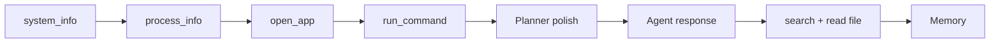

### Phase 1 — MVP tools ✅ (đã implement)

| # | File | Việc làm | Test nhanh |
|---|------|----------|------------|
| 1 | `tools/system_info.py` | `psutil`: CPU %, RAM used/total, disk | *"RAM hiện tại?"* |
| 2 | `tools/process_info.py` | Liệt kê process (tên, PID), lọc theo tên | *"ứng dụng nào đang chạy?"* |
| 3 | `tools/open_app.py` | Map alias (`code`, `chrome`, `notepad`) → `os.startfile` / `subprocess` | *"mở VS Code"* |
| 4 | `tools/run_command.py` | `subprocess.run`, timeout, cwd, capture stdout/stderr | *"chạy dir"* |

**Chuẩn hóa kết quả tool** (một lần, dùng chung):

```python
{"success": bool, "message": str, "data": Any}
```

Có thể thêm `tools/result.py` với helper `ok()` / `fail()` — tránh lặp.

**Executor:** đã gọi `TOOL_REGISTRY[tool](**args)` — chỉ cần planner trả đúng `tool` + `args`.

---

### Phase 2 — Planner ổn định hơn (~0.5 ngày)

| # | File | Việc làm |
|---|------|----------|
| 5 | `agent/planner.py` | Log lỗi Gemini (không nuốt im lặng); retry khi JSON lỗi |
| 6 | `prompts/planner_prompt.txt` | Ví dụ tiếng Việt + map alias app |
| 7 | `agent/agent.py` | (Tuỳ chọn) Gọi Gemini lần 2 để **tóm tắt** kết quả tool cho UI |

Luồng đề xuất:

```text
User → Planner (JSON steps) → Executor (từng tool)
     → Agent tổng hợp message hiển thị trên command bar
```

---

### Phase 3 — File tools (README Phase 2)

| # | File | Việc làm |
|---|------|----------|
| 8 | `tools/search_file.py` | Tìm theo keyword (giới hạn thư mục / depth) |
| 9 | `tools/read_file.py` | Đọc txt/md/code, giới hạn ký tự |

---

### Phase 4 — Memory có ích (~1 ngày)

| # | File | Việc làm |
|---|------|----------|
| 10 | `agent/memory.py` | Bảng `memories`; inject vào planner prompt |
| 11 | Planner | Nhận diện *"thư mục X của tôi là …"* → `save_memory` |

---

### Phase 5 — Cứng hoá (sau khi MVP chạy)

- Tool registry + validate `args` (Pydantic)
- Logging file (`logs/agent.log`)
- Unit test từng tool (mock subprocess)
- UI: hiển thị từng bước plan (✓ Found file → ✓ Running g++)

---

### Thứ tự implement đề xuất



**Bước tiếp theo nên làm ngay:** Phase 1 — 4 tool MVP, rồi test qua UI với *"RAM?"*, *"mở notepad"*, *"app nào đang chạy?"*.

---

Bạn muốn tôi **bắt đầu code Phase 1** (4 tool + chuẩn hóa `result`) luôn không?